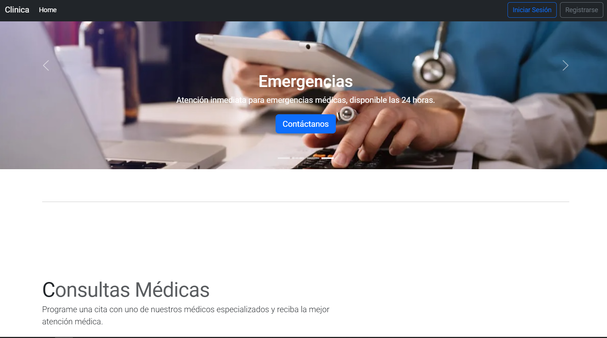
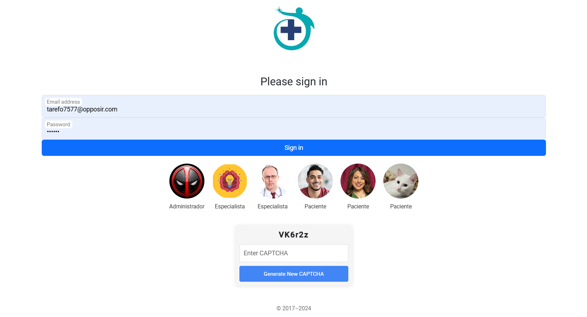
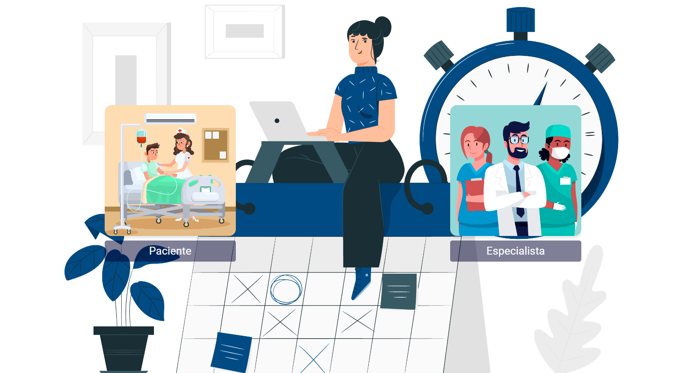
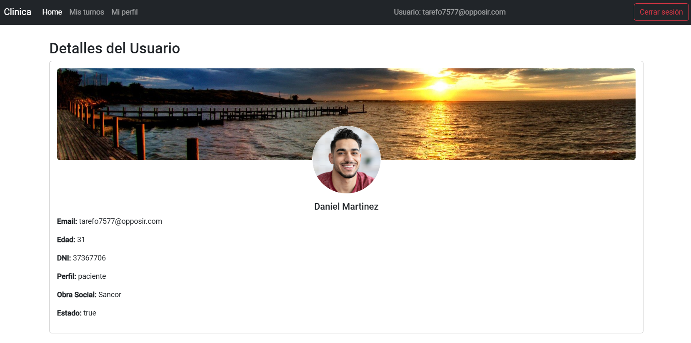
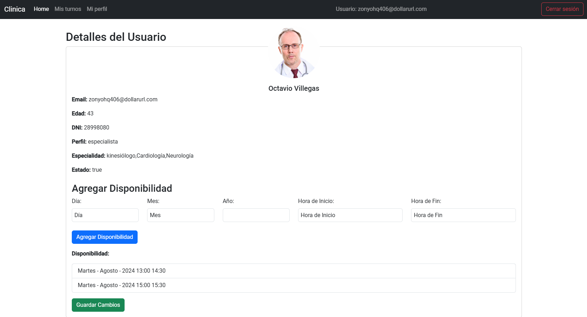
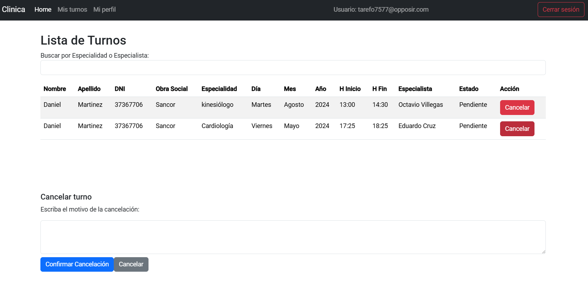
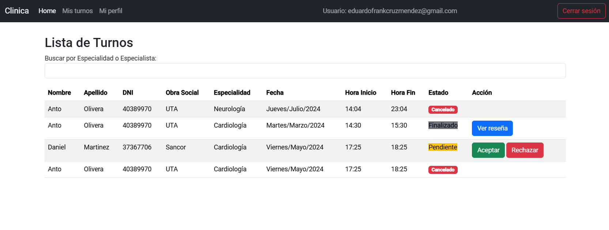
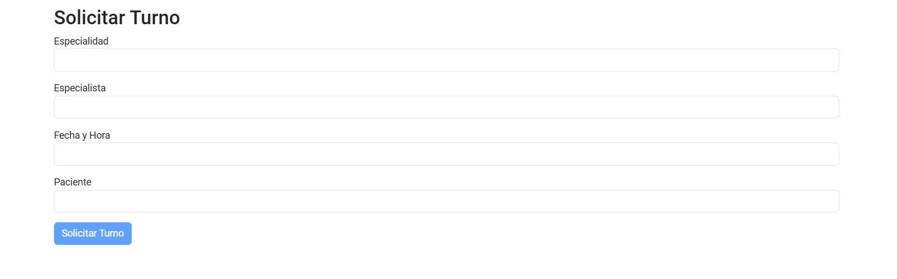
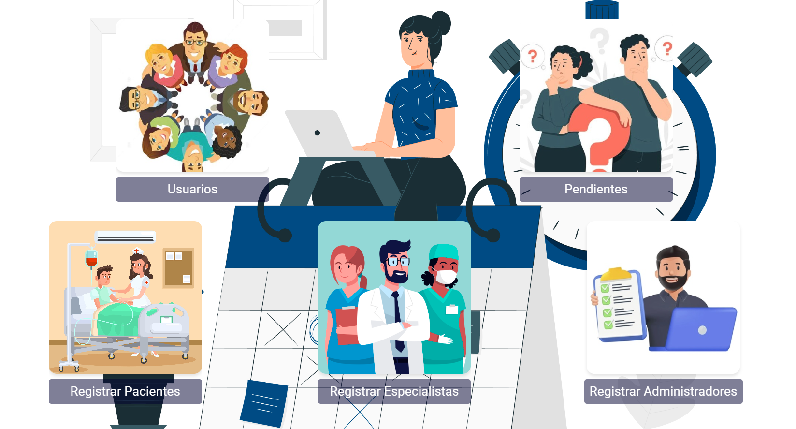

# Proyecto Clínica TP-FINAL

## Descripción General

La Clínica TP-FINAL es una plataforma diseñada para la gestión de turnos para pacientes, especialistas, administradores y su interacción en un entorno médico. El sistema permite a los usuarios acceder a distintas funcionalidades dependiendo de su pefil, como la gestión de turnos, acceso a información usuarios y dar de alta usuarios.

## Pantallas Principales

El sistema está dividido en varias secciones, accesibles a través de un menú de navegación. A continuación, se describen las pantallas principales y su contenido.

### 1. **Pantalla de Inicio (Home)**

- **Descripción**: La página inicial presenta un menú con opciones de inicio de sesión, registro

- **Acceso**: Esta pantalla es la primera que el usuario verá al ingresar a la aplicación.
- **Contenido**:
  - **Botón "Iniciar sesión"**: Para los usuarios registrados, permite acceder al sistema.
  - **Botón "Registrarse"**: Para los nuevos usuarios que desean crear una cuenta.

### 2. **Pantalla de Login (Inicio de sesión)**

- **Descripción**: En esta pantalla, los usuarios pueden iniciar sesión con su correo electrónico y contraseña.
- **Acceso**: Se accede desde la pantalla de inicio.
- **Contenido**:
  - **Formulario de inicio de sesión**: Campo para ingresar correo electrónico y contraseña.
  - **Botón "Iniciar sesión"**: Valida las credenciales y accede a la plataforma.
  - **Captcha**: Se muestra automáticamente en el proceso de autenticación cuando es necesario.
  

### 3. **Pantalla de Registro (Especialista, Paciente)****

- **Descripción**: Esta sección permite a los nuevos usuarios crear una cuenta.
- **Acceso**: Se accede desde la pantalla de inicio de sesión.
- **Contenido**:
  - **Formulario de registro**: Campos para ingresar nombre, correo electrónico, contraseña y otros datos relevantes.
  - **Botón "Registrar"**: Crea una nueva cuenta y redirige a la pantalla de inicio de sesión.
  

### 4. **Pantalla de Mi Perfil (Administrador, Especialista, Paciente)**

- **Descripción**: Dependiendo del rol, esta pantalla muestra la información y opciones disponibles para cada tipo de usuario (Administrador, Especialista, Paciente).
- **Acceso**: Se accede tras iniciar sesión, según el tipo de usuario.
- **Contenido**:
  - **Perfil del usuario**: Información como nombre, rol, imagen de perfil y otras configuraciones.
  - **Acciones disponibles**:
    - **Administrador**: Acceso a la administración de usuarios, gestión de turnos y visualización de estadísticas.
    - **Especialista**: Acceso a las turnod asignadas, historial médico de pacientes y posibilidad de agregar notas médicas.
    - **Paciente**: Visualización de sus turnos, historial médico y la opción de reservar nuevos turnos.

    - **Paciente**
    

    - **Paciente**
    

### 5. **Pantalla de Mis Turnos**

- **Descripción**: Permite a los pacientes ver sus turnos y a los especialistas ver sus asignados.
- **Acceso**: Desde la pantalla de perfil o el menú principal, según el rol del usuario.
- **Contenido**:
  - **Calendario de citas**: Muestra las citas que tiene el paciente o las citas asignadas al especialista.
  - **Formulario para agendar citas**: Los pacientes pueden seleccionar fecha, hora y el especialista con quien desean realizar la consulta.
  - **Botón "Cancelar cita"**: Permite a los pacientes o especialistas cancelar citas previamente agendadas.
  
  - **Paciente"**
  
  
  - **Especialista"**
  

### 6. **Pantalla de Solicitar Turnos**

- **Descripción**: Permite a los pacientes reservar turnos y a los administradores gestionarlas.
- **Acceso**: Desde la pantalla de perfil o el menú principal, según el rol del usuario.
- **Contenido**:
  - **Calendario de citas**: Muestra las citas disponibles del especialista.
  - **Formulario para agendar citas**: Los pacientes pueden seleccionar fecha, hora y el especialista con quien desean realizar la consulta.
  

### 7. **Pantalla de Usuarios(Administrador)**

- **Descripción**: Permite al administrador gestionar varias funciones del sistemas.
- **Acceso**: Desde la pantalla de home o el menú principal.
- **Contenido**:
  - **Boton Usuarios**: Muestra todos los usuaios en el sistemas.
  - **Boton Pendientes**: Muestra todos los especialistas del sistemas a dar de alta como deshabilitarlos.
  - **Boton Registro Paciente**: Muestra formulario para registrar un nuevo paciente.
  - **Boton Registro Especialista**: Muestra formulario para registrar un nuevo especialistas.
  - **Boton Registro Administrador**: Muestra formulario para registrar un nuevo administrador.
  

## Acceso a las Diferentes Secciones

Cada sección de la plataforma se puede acceder a través de un menú de navegación, con las siguientes rutas disponibles:

- **Home**: Ruta inicial donde se encuentra el acceso a las opciones de inicio de sesión y registro.
- **Login**: Ruta para ingresar al sistema con las credenciales del usuario.
- **Registro**: Ruta para crear una nueva cuenta en el sistema.
- **Mi Perfil**: Accesible después de iniciar sesión, dependiendo del rol del usuario (Administrador, Especialista, Paciente).
- **Mis Turnos**: Accesible desde el perfil del usuario, para visualizar las citas.
- **Solicitar Turno**: Accesible desde el perfil del usuario, para agendar nuevas citas.

## Tecnologías Utilizadas

Este proyecto está desarrollado con las siguientes tecnologías:

- **Frontend**: Angular, Bootstrap
- **Backend**: Firebase Authentication, Firebase Database, Firebase Storage
- **Estilos**: Bootstrap, CSS personalizado

